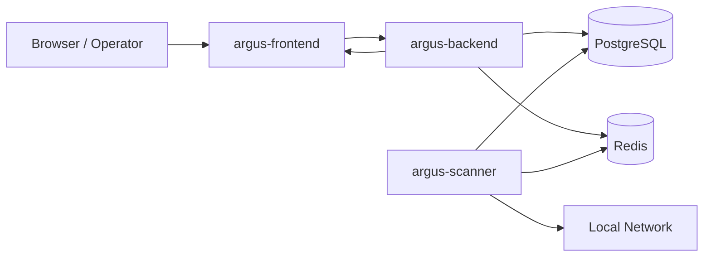

# Architecture

Argus uses a multi-service architecture that separates network-facing discovery from API and UI concerns.

## High-Level Components

| Component | Responsibility |
|---|---|
| `argus-scanner` | active scanning, passive observations, scheduled tasks, log ingestion |
| `argus-backend` | REST API, WebSocket events, persistence, enrichment, auth, orchestration |
| `argus-frontend` | dashboards, scan management, topology, settings, asset workflows |
| PostgreSQL | source of truth for assets, scans, findings, evidence, settings, history |
| Redis | Celery broker and event channel for live updates |

## Component Relationship

- The frontend talks to the backend over HTTP and WebSocket.
- The backend persists application state in PostgreSQL.
- The scanner executes discovery and scheduled work, then writes results through shared backend models and persistence logic.
- Redis is used for task coordination and event fan-out.

## Mermaid Diagram Placeholder

## Runtime Flow

### 1. Discovery

- A manual or scheduled scan creates a scan job.
- The scanner resolves targets, performs discovery, and runs deeper probes.
- Results are normalized into asset evidence, ports, probe runs, and scan summaries.
- The backend persists updates and emits live events.

### 2. Inventory and Enrichment

- Assets are stored in PostgreSQL.
- Fingerprinting evidence is correlated into classifications and hypotheses.
- Optional enrichment can use Ollama and approved external lookups.

### 3. Visualization and Operations

- The frontend reads inventory and topology data from the backend API.
- Running scans stream status over WebSocket.
- Operators can trigger scans, review evidence, inspect findings, and manage settings.

## Why the Scanner Is Separate

`argus-scanner` is isolated from the API process because it needs elevated network capabilities and direct interaction with the local network.

Benefits:

- reduced backend attack surface
- cleaner separation of API and discovery logic
- easier Docker privilege management
- better support for host-networked scanning in development

:::info Host Networking
In development, the scanner uses host networking so it can see the real LAN and passive traffic more accurately. This is especially important for ARP-based discovery and network-local probing.
:::

## Data Flow Summary

| Stage | Primary Owner | Output |
|---|---|---|
| discovery | scanner | responsive hosts, probe data, passive observations |
| normalization | backend/shared logic | assets, ports, evidence, probe runs |
| enrichment | backend | classifications, AI analysis, findings, lifecycle data |
| delivery | backend | REST responses, WebSocket events |
| visualization | frontend | dashboards, tables, graphs, settings UI |

## Storage Model

PostgreSQL holds the durable state for:

- assets
- asset history
- ports
- scans
- topology links
- findings
- fingerprint evidence
- hypotheses
- passive observations
- settings
- audit events
- integration module state

Redis is intentionally not the long-term system of record.

## Operational Boundaries

| Concern | Handled By |
|---|---|
| authentication | backend |
| authorization | backend |
| scan execution | scanner |
| inventory persistence | backend + database layer |
| event streaming | backend + Redis pub/sub |
| user interaction | frontend |

## Related Docs

- [Getting Started](./getting-started.md)
- [Scanner Guide](./guides/scanner.md)
- [Backend API Guide](./guides/backend-api.md)
