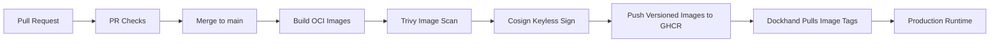
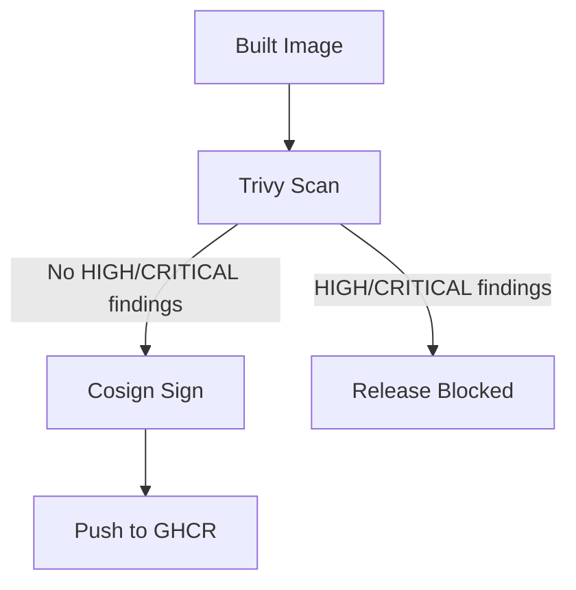

# CI/CD Security Guide

Argus uses GitHub Actions to enforce quality and security gates before code reaches production images, and before production images are pulled by Dockhand.

Static analysis with SonarQube is intended to run locally by the operator before pushing code, not as a GitHub-hosted gate.

This pipeline is designed as a layered control system rather than a single pass/fail check. Each gate reduces a different class of delivery risk:

- correctness risk: broken tests, failed builds, invalid docs
- supply-chain risk: vulnerable OS or package layers inside published images
- release integrity risk: unsigned or ambiguous images
- deployment drift risk: Dockhand pulling mutable or locally built artifacts instead of versioned images

## Control Objectives

| Control | Primary Risk Reduced | Delivery Stage |
|---|---|---|
| backend tests and lint | functional regressions, unsafe refactors | pull request |
| frontend lint, type-check, build | UI/runtime regressions | pull request |
| docs build | broken operator guidance and deployment docs | pull request |
| image build in CI | non-reproducible server-side builds | merge to `main` |
| Trivy image scan | vulnerable packages in release artifacts | merge to `main` |
| Cosign signing | image tampering and provenance ambiguity | merge to `main` |
| GHCR versioned tags | rollback and traceability failure | merge to `main` |
| Dockhand image-tag deployment | source/build drift on deployment host | deploy |

## Pipeline Overview

## Pull Request Gates

Pull requests run three classes of preventative controls:

- backend quality: `ruff`, migrations, and backend tests with coverage
- frontend quality: ESLint, TypeScript type-checking, and production build
- docs quality: Docusaurus build of the operator documentation site

These are designed to catch delivery failures before they become deployment artifacts.

## Local SonarQube Workflow

SonarQube is no longer part of the hosted GitHub Actions pipeline for this repo.

The intended operating model is:

- developers run SonarQube locally before pushing
- GitHub Actions remains focused on tests, builds, and release-image security gates
- Sonar findings are reviewed as a local pre-push quality control step

## Release Artifact Controls

After merge to `main`, GitHub Actions builds:

- `argus-backend`
- `argus-scanner`
- `argus-frontend`

Each image is:

1. tagged with `main`
2. tagged with the Git commit SHA
3. scanned by Trivy
4. signed by Cosign using GitHub OIDC
5. pushed to GHCR

This moves release creation into CI so the deployment host is no longer responsible for building application code.

## Image Security Gate

Trivy scans each built image and fails the release workflow on `HIGH` or `CRITICAL` findings.

That gate is primarily about release acceptance risk:

- do not promote artifacts with severe known vulnerabilities
- avoid normalizing “ship now, patch later” on critical package risk
- attach SARIF results into GitHub so security review has a durable trail

## Provenance and Signing

Cosign keyless signing gives each image a verifiable integrity marker tied to the GitHub Actions identity that produced it.

This reduces:

- ambiguity about who built the image
- risk of untrusted replacement artifacts
- rollback confusion when multiple artifacts share a weak tag name

Operators should prefer immutable SHA-tagged images in Dockhand when they want strong rollout traceability.

## Dockhand Deployment Model

Dockhand should deploy published images, not build the repo.

Recommended model:

- `docker-compose.yml` points at GHCR images
- Dockhand overrides image tags or image variables as needed
- production hosts pull signed images by tag

This separates:

- build trust boundary: GitHub Actions
- runtime trust boundary: Dockhand / production host

That separation is important for risk containment. If a deployment host is compromised or misconfigured, it should not also be your build system.

## Required GitHub Configuration

No Sonar-specific GitHub repository secrets or variables are required by the hosted pipeline anymore.

## Required Dockhand Variables

To consume CI-built images in production, set image references explicitly if you want immutable deployments:

- `ARGUS_BACKEND_IMAGE`
- `ARGUS_SCANNER_IMAGE`
- `ARGUS_FRONTEND_IMAGE`

Recommended pattern:

- `ARGUS_BACKEND_IMAGE=ghcr.io/joelmale/argus-backend:sha-<commit>`
- `ARGUS_SCANNER_IMAGE=ghcr.io/joelmale/argus-scanner:sha-<commit>`
- `ARGUS_FRONTEND_IMAGE=ghcr.io/joelmale/argus-frontend:sha-<commit>`

If you use the floating `main` tag instead, deployments are simpler but rollback and forensic traceability are weaker.

## Risk Framing Summary

| Threat / Failure Mode | Primary Control |
|---|---|
| merge breaks backend behavior | backend PR checks |
| merge breaks frontend runtime | frontend PR checks |
| docs drift from reality | docs build gate |
| vulnerable package ships in release image | Trivy |
| deployment host builds a different artifact than CI | GHCR image publish model |
| image authenticity is unclear | Cosign signing |
| production rollout is hard to trace or roll back | SHA-tagged images |

## Related Files

- [`.github/workflows/pr-checks.yml`](../../.github/workflows/pr-checks.yml)
- [`.github/workflows/release-images.yml`](../../.github/workflows/release-images.yml)
- [`docker-compose.yml`](../../docker-compose.yml)
- [`.env.production`](../../.env.production)
